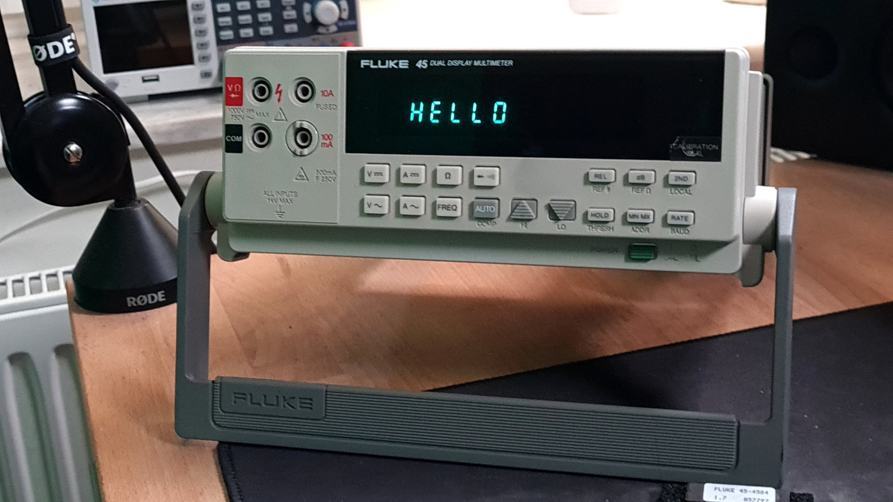
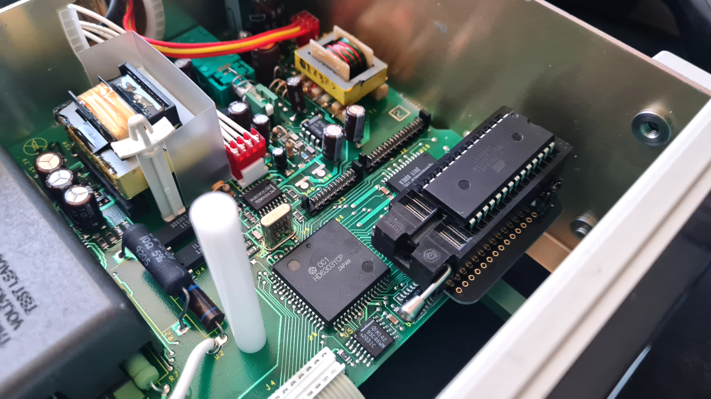
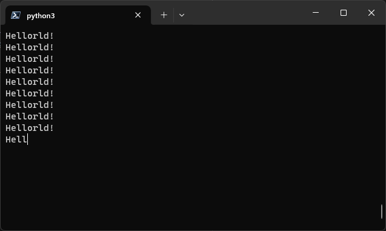

Hellorld! on a Fluke 45
=======================

Hellorld! challenge is in short to get an old computer, or other equipment, to
print out "Hellorld!" using assembly, or print it in with hex.

This is an attempt to get it running on a Fluke 45 multimeter, by replacing the
ROM

[Video available on youtube](https://youtu.be/mPH0PppvqbA)

Hellorld! from Usagi Electric
-----------------------------

To see the original story about "Hellorld!", tune in to
[Usagi Electrics](https://www.youtube.com/@UsagiElectric) original
[Hellorld! video](https://youtu.be/gQ6mwbTGXGQ)

For other Hellorld! implementations, check the
[Hellorld! wiki](https://github.com/Nakazoto/Hellorld/wiki)

Architecture
------------

The Fluke 45 is based upon a HD6303Y CPU from Hitachi.

It has 16 bits address bus and 8 bit data bus.

There are four devices on the addr/data bus:

- ROM - storing the firmware, a 64kB EPROM
- RAM - extra memory
- IEEE 488 expansion board - for HP/IB
- Internal registers and some RAM internally in HD6303Y

The memory map is as follows

| Addr          | Chip    | Usage        |
| ------------- | ------- | ------------ |
| $0000 - $0027 | HD6303Y | Registers    |
| $0040 - $01FF | HD6303Y | Internal RAM |
| $2000 - $3FFF | RAM     | External RAM |
| $4000 - $FFFF | ROM     | Program ROM  |

ROM chip
--------

Fluke 45 uses a 64kB ROM, not reprogrammable

This implementaion instead uses an 8kB AT28C64B EEPROM.

Therefore:
- A15 and A13 will be sent to N/C pins on AT28C65B
- A14 is sent to /WE pin, active low

Therefore, an adaptor has been made to tie /WE pin on EEPROM to 5V. See below.

This means A13-A15 is therefore not used, and the 8kB will be wrapped around 6
times throughout the Program ROM.

This implementation uses only the address range $e000-$ffff in the Program ROM
range.

Note that the only addresses used within the Program ROM should have A14 set to
high while ROM chip is enabled (/CE is low), and therefore in theory, it should
work without adaptor too.

Display Module
--------------

The display is controlled by a small CPU in the display unit, which communicate
with the main CPU using an SPI-like bus, with a custom protocol without
documentation publicly available.

More information about the protocol is available from reverse engineering in the
[Display documentation](docs/display.md)

Hellorld Serial
---------------

First implemenation, starting up the CPU and continously printing out
`Hellorld!` on the serial port at 9600 baud, 8 bit, 1 stop bit, no parity.

Code is available in `src/hellorld_serial.asm`, using libraries from `src/lib`.

Output can be seen on a serial emulator:

Hellorld
--------

Having hellorld printed out on serial is cool, and simpler. But goal is to print
it out on the display.

the VFD display has 5 digits for main display, 5 smaller digits on a secondary
display, and a couple of extra indicators. Most of the digits are 7 segments,
where a few has an extra segment for a proper capital R.

Therefore, it makes most sense to have a scrolling "hellorld" that fits within
normal 7 segment letters.

Result can be seen on top of this page

It is fully running on a custom ROM, available in `src/hellorld.arm`

Display Proxy
-------------

As help for reverse engineering, there is a tool `src/display_proxy.asm` that
can be used together with `control_disp.py` to control the display.

The tool receives data via serial port and unmodified passes the data over to
the display module, for faster testing.
