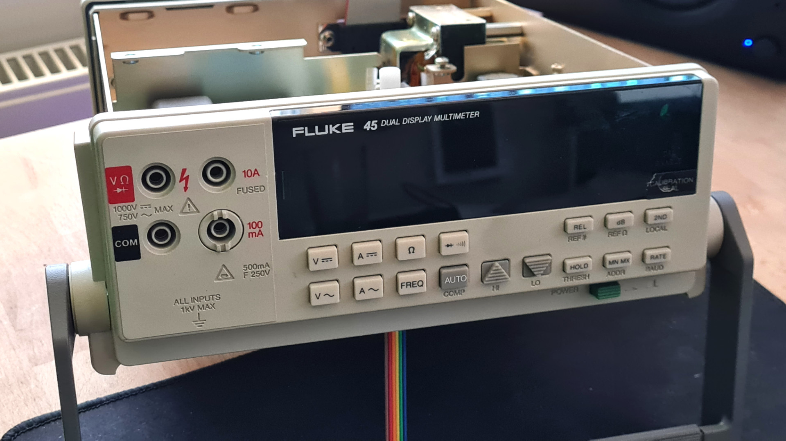

Hellorld! on a Fluke 45
=======================

Hellorld! challenge is in short to get an old computer, or other equipment, to
print out "Hellorld!" using assembly, or print it in with hex.

https://youtu.be/gQ6mwbTGXGQ

This is an attempt to get it running on a Fluke 45 multimeter, by replacing the
ROM

Architecture
------------

The Fluke 45 is based upon a HD6303Y CPU from Hitachi.

It has 16 bits address bus and 8 bit data bus.

There are four devices on the addr/data bus:

- ROM - storing the firmware, a 64kB EPROM
- RAM - extra memory
- IEEE 488 expansion board - for HP/IB
- Internal registers and some RAM internally in HD6303Y

The memory map is as follows

| Addr          | Chip    | Usage        |
| ------------- | ------- | ------------ |
| $0000 - $0027 | HD6303Y | Registers    |
| $0040 - $01FF | HD6303Y | Internal RAM |
| $2000 - $3FFF | RAM     | External RAM |
| $4000 - $FFFF | ROM     | Program ROM  |

ROM chip
--------

Fluke 45 uses a 64kB ROM, not reprogrammable

This implementaion instead uses an 8kB AT28C64B EEPROM.

Therefore:
- A15 and A13 will be sent to N/C pins on AT28C65B
- A14 is sent to /WE pin, active low

Therefore, an adaptor has been made to tie /WE pin on EEPROM to 5V. See below.

This means A13-A15 is therefore not used, and the 8kB will be wrapped around 6
times throughout the Program ROM.

This implementation uses only the address range $e000-$ffff in the Program ROM
range.

Note that the only addresses used within the Program ROM should have A14 set to
high while ROM chip is enabled (/CE is low), and therefore in theory, it should
work without adaptor too.

Hellorld Serial
---------------

First implemenation, starting up the CPU and continously printing out
`Hellorld!` on the serial port at 9600 baud, 8 bit, 1 stop bit, no parity.

Code is available in `src/hellorld_serial.asm`, using libraries from `src/lib`.

Output can be seen on a serial emulator:

Hellorld
--------

Goal is to get Hellorld written on the VFD display.

However, that display is controlled by a microcontroller in the display unit,
which communicate with the main CPU using an SPI-like bus, with a custom
protocol without documentation.

Progress is made for reverse engineering the protocol, but still work in
progress.